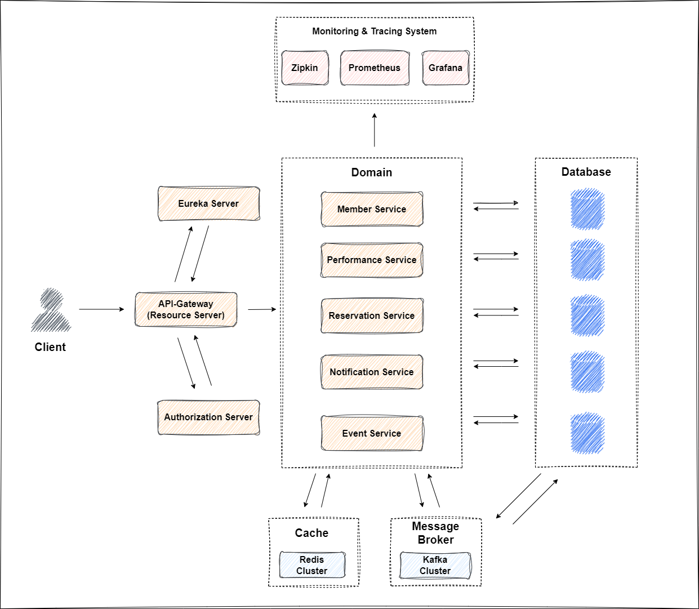

# **공연 예약 시스템**

## **목차**

#### [1. 프로젝트 개요](#프로젝트-개요-1)

#### [2. 기술 스택](#2-기술-스택-1)

#### [3. 아키텍처](#3-아키텍처-1)

#### [4. Document](#4-document-1)

#### [5. 요구사항](#5-요구사항-1)

#### [6. 이슈](#6-이슈-1)

<br>

---

# **1. 프로젝트 개요**

**MSA 아키텍처**로 **Spring Cloud**를 이용하고 **멀티 모듈**로 공통 코드는 분리하여 설계하며 간단한 하나의 시스템을 만들어 보는 것을 목표로 합니다. 대부분의 코드는 가능하면 **TDD** 위주로 구현할 예정이며, 가능한 모든 기법을 연습해보려고 합니다. 프로젝트 내용은 공연 예약에 대한 전반적인 기능을 제공하는 온라인 서비스입니다.  
공연자 혹은 기획자는 공연 정보를 등록, 수정, 공연 일정 및 가격 설정 기능을 통해 공연을 등록할 수 있습니다. 또 등록된 공연의 예약 현황을 확인할 수 있습니다.
사용자는 등록된 공연 중 원하는 공연을 선택하여 예약을 할 수 있습니다.
관리자는 모든 예약 내용을 조회하고 수정 또는 삭제 할 수 있습니다. (결제 시스템은 추후 추가 미정)

<br>

# **2. 기술 스택**

```
MSA architecture
Spring Cloud 2022.0.2
Spring Cloud Gateway, Eureka Server, Eureka Client
Java 17
Spring Boot 3.0.4
Spring Data JPA 3.0.4
MapStruct 1.5.2
QueryDsl 5.0.0
Kafka 3.3.2
Redis 3.0.5
Micrometer Tracing
Prometheus 2.37.7
Zipkin 2.24
Grafana 9.5.1
Docker
MySQL
PostgreSQL
```

<br>

# **3. 아키텍처**



<br>

# **4. Document**

#### \* [API 문서](./document/api-document.md)

#### \* [기능별 테스트 케이스](./document/test-case.md)

#### \* [설치 및 실행 방법](./document/install-document.md)

<br>

# **5. 요구사항**

## 1. 사용자 기능

- 회원가입 기능(기획자, 일반)
- 로그인, 로그아웃 기능
- 사용자 정보 수정, 조회, 회원 탈퇴 기능
- 예약 가능한 공연 조회 기능
- 원하는 공연 선택 예약 기능
- 예약 정보 확인, 수정, 취소 기능

## 2. 기획자 기능

- 공연 정보 등록 및 수정 기능
- 공연 일정 및 가격 설정 기능
- 등록한 공연 예약 현황 조회 기능
- 공연 취소 또는 변경 알림 발송 기능
- 기획자별 공연 정보 조회 기능

## 3. 관리자 기능

- 전체 예약 내용 조회, 수정, 취소 기능

## 4. 시스템 기능

- 예약 정보, 결제 정보, 취소 정보 Kafka 이벤트 발행 기능
- 이벤트 수신 서비스 내부 데이터 업데이트 기능
- 예약 가능한 공연 관리 기능
- 예약, 결제 로그 기록 기능

## 5. 알림 기능

- 사용자에게 예약, 취소 알림

<br>

# **6. 이슈**

### [1. 예약 신청이 동시에 엄청난 양이 온다면?](./document/many-reservation.md)

### [2. 관심사의 분리](./separation-of-concerns.md)

### [3. 모니터링 구성(Local + Docker)](./document/monitoring-docker-local.md)
