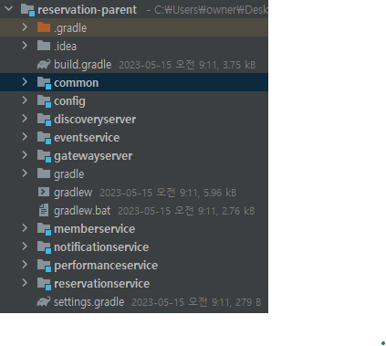
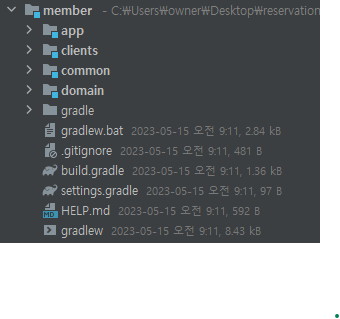
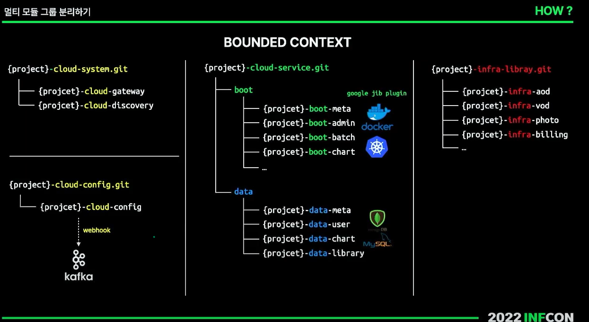
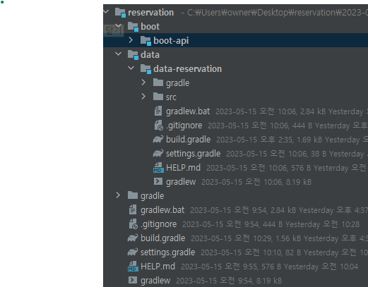

# 전체 구조를 바꾼 이유

## 목차

#### [전체 구조를 바꾼 이유](#전체-구조를-바꾼-이유)

#### [역할과 책임](#역할과-책임-1)

#### [적용하기](#적용하기-1)

##### [\* 우아한 형제들](#우아한-형제들-방법-적용하기)

##### [\* 네이버](#네이버-방법-적용하기)

#### [느낀점](#느낀점-1)

---

<br>

이 글은 멀티모듈을 구성하면서 느꼈던 것을 적고자 한다.

처음 프로젝트를 멀티모듈로 구성했을 때의 구조는 심플 했다. root 모듈 안에 공통 모듈, 구성 모듈, 각 서비스를 한 곳에 모아놨다. 사실 아무 생각 없었다. 공통된 것들은 **common**으로 빼고 구성도 각 서비스별 **config**에 분리해서 보관하면 될까? 라는 안일한 생각으로 만들었다.



그러다 공연 서비스에서 실패하거나 대기중인 이벤트를 처리할 batch나 scheduler 가 필요할 것 같다는 생각에 추가하려고 보니 몇 가지 문제가 생겼었다.

- **batch를 각 서비스별로 만들어야 하나?**
- **공통 batch 모듈로 만들어야 하나?**
- **batch 모듈을 만들면 common, config 모듈을 의존해야 하나?**

꼬리에 꼬리를 무는 문제와 생각들이, 멀티 모듈을 왜 하는지, 어떻게 해야 하는지에 대한 이해가 없었다는 것을 깨닫게 해줬다.

먼저 MSA 아키텍처는 각 서비스들이 독립적으로 구성되어 언제든 다른 언어나 프레임워크로 교체가 가능하다는 것이 장점인데.

이 구조는 그렇지가 않았다. 그래서 각 서비스별로 멀티모듈로 나누기로 결정했다. 그러기 앞서 각 모듈의 구조를 어떻게 해야할지가 중요했는데.

일반적으로 멀티모듈의 구성은 아래와 같을 것 같다.

- **root** : 전체 프로젝트를 관리하는 최상위 모듈, 공통적인 설정이나 의존성을 정의한다.
- **core** : 핵심 도메인이나 공통 로직을 담는 모듈로 다른 모듈이 의존하게 된다.
- **api** : 외부에 노출되는 API를 제공하는 모듈이다.
- **batch** : 배치 작업을 수행하는 모듈이다.

이 밖에도 common, domain, repository 등 다양할 것이다.

멀티모듈에 관해서 구글링 해본 결과, 대표적으로 [우아한 형제들](https://techblog.woowahan.com/2637/), [인프콘: 네이버](https://www.youtube.com/watch?v=ipDzLJK-7Kc) 이 내용을 모두 적용해보고자 한다.

<br>

# 역할과 책임

자세한 내용은 링크에 포함되어 있기 때문에 제외한다. 두 링크 내용의 핵심은 **common 모듈의 비대화**와 **역할과**

**책임**이라고 생각된다.

common 모듈을 의존하는 모듈이 많을 수록 중복 코드를 가지게 되어 유지보수와 확장성에 어려움을 가지게 되고 하나의 코드 변경이 다른 모듈들에 영향을 미치게 된다.

그렇게 점점 커지는 모듈로 인해 빌드와 배포 시간이 증가해지고 테스트 범위도 넓어지게 된다.

이러한 문제에 대해 두 내용은 비슷하지만 다른 결론을 내린다. [우아한 형제들](https://techblog.woowahan.com/2637/)의 내용에서는 **공통 모듈 계층의 의존성을 모두 제외하고 순수 Java Class**

**만 정의**한다.

[인프콘: 네이버](https://www.youtube.com/watch?v=ipDzLJK-7Kc)에서는 common 모듈로 나누지 않고 **각 모듈에 어느정도의 공통 코드를 허용**한다.

두 내용에서 공통적인 부분이 있었는데. 그건 **역할과 책임**에 따라 모듈을 나누는 것이었다. **역할과 책임**에 따라 각 모듈을 나누게 되면, 각 모듈은 자신의 역할에 맞는 작업만 수행하므로 중복 코드는 줄어들고 테스트와 작업의 품질이 높아진다.

무슨 말인지 이해는 되지만 같은 말에 다른 구조로 설명하니 두 방법 중에 어떤 방식을 선택을 하는게 나을지 판단할 수 없었다. 그래서 일단 적용해보기로 했다.

<br>

# 적용하기

## 우아한 형제들 방법 적용하기

우아한 형제들 링크의 구조는 크게 다섯 가지 계층으로 나뉜다.

- **독립 모듈 계층**
- **도메인 모듈 계층**
- **내부 모듈 계층**
- **공통 모듈 계층**
- **어플리케이션 모듈 계층**

member와 performance 서비스를 최대한 우아한 형제들의 방식으로 하여 멀티모듈을 구성했다.



완전히 처음부터 설계를 하고 구현에 들어갔어야 하는데. 기존 코드를 새로운 구조로 옮기보니 완전히 분리하지는 못했다.

모아있던 코드를 분리하고 의존성을 분리하다 보니, Entity → Dto, Dto → Entity 등 뒤섞여 있던 로직들이 깔끔하게 정리된 느낌이었다. 기존 회원 가입 api에서 단순히 `SignUpDto` 로 받은 뒤 Service 계층에서 Entity로 변환하는 과정이었는데.

`MemberCreateRequest` 로 api 모듈에서 받게 되고 도메인 모듈의 서비스 계층에 전달하기 위해 `MemberCreateDto`

로 변환한 뒤 Entity로 매핑하게 했는데.

각 모듈의 진입 Dto를 구성하는 과정이 계층의 경계를 확실하게 느껴졌다. 이렇게 바꿈으로써 api를 어느 모듈로든 교체가 가능하게 됐다.

이 밖에도 각각의 책임에 맞게 코드를 분리하다 보니 책임에 따라 코드를 찾아가기가 훨씬 쉬워졌다.

<br>

## 네이버 방법 적용하기

reservation, discovery, gateway 서비스는 네이버의 방식으로 구성했다.



cloud-system 은 하나의 멀티모듈로 구성했고. reservation은 이미지의 가운데처럼 구성했다.



사실 30분간의 영상을 통해 직접 적용해보니 부족한 부분이 너무 많았다. 디테일하게 어떻게 구성해야 하는지에 모르기 때문에 알맞게 구성했다고 생각되지 않는다.

common 모듈은 제외하며 boot와 data에 각각 서비스를 둔다는 것이 boot와 data의 핵심이었는데. 각 서비스의 역할과 책임은 어디까지 줘야하는건지. 메서드명이 중복되는건가? boot 서비스에서는 정확히 뭘 해야 하는건가? 와 같이 의문점들이 끊이질 않았다.

한참 고민을 하다. 강연에서 강조하던 **역할과 책임**이 떠올랐고, boot의 역할은 뭐지? data의 역할은 뭘까? 왜 서비스를 각각 나누는거지?

개인적으로 내린 결론은 **서비스를 통해서 각각의 역할과 책임**을 구분한 것이라고 생각된다. 서비스를 통해 역할과 책임을 명확하게 구분하고 모듈 간의 의존성을 최소화한 것이 아닐까 싶다.

**boot 모듈의 서비스에서는 애플리케이션의 실행과 관련된 서비스를 제공**하고 **data 모듈에서는 도메인과 관련된 서비스를 제공**한다.

이렇게 각 모듈의 역할과 책임에 따라 서비스를 구현하고 메서드로 메시지를 표현했다.

**boot 모듈**

```java
public interface ReservationService {
    ReservationResultResponse applyReservation(Long performanceId, Long scheduleId, ReservationApplyRequest reservationApplyRequest);
}
```

예약 신청이라는 메시지를 ReservationService에 요청한다.

**domain 모듈**

```java
public interface ReservationCommandService {
    ReservationDto createReservation(Long performanceId, Long scheduleId, ReservationDto reservationDto);
}
```

도메인에 대한 명확한 표현을 위해 예약 도메인 생성이라는 메시지로 표현했다.

<br>

# 느낀점

두 가지 방법을 모두 적용하면서 느낀점은 ‘정답은 없구나’ 라는 것을 느꼈다. 각각 방법의 차이일 뿐이었고 내가 만들 서비스에 맞게 구조를 만들면 되는거였다.

변경 가능성이 적고 단일 프로젝트라면 굳이 멀티모듈을 구성할 필요가 없을 것이다. 두 방법은 변화하는 프로젝트의 영향을 최소화하는 방법들일 것이다.

사실 적용한지 얼마되지 않았고 이해의 부족으로 두 방식 중에 어떤 것이 낫다 뭐다 하지는 못하겠다. 다만 얻은 건 있다. 우아한 형제들의 방식을 통해 각 계층간의 경계와 의존성 방향을 이해할 수 있었고 네이버의 방식을 통해 역할과 책임을 한층 더 이해할 수 있었다.
