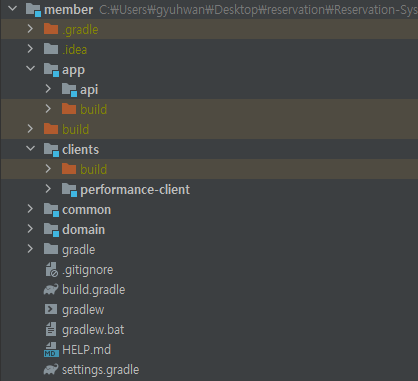

## 목차

#### [전체 구조를 바꾼 이유](#전체-구조를-바꾼-이유)

#### [역할과 책임](#역할과-책임-1)

#### [적용하기](#적용하기-1)

##### [\* 우아한 형제들](#우아한-형제들-방법-적용하기)

##### [\* 네이버](#네이버-방법-적용하기)

#### [느낀점](#느낀점-1)

<br>

---

# 전체 구조를 바꾼 이유

이 글은 멀티모듈을 구성하면서 느꼈던 것을 적고자 한다.

처음 프로젝트를 멀티모듈로 구성했을 때의 구조는 심플 했다. root, common, config, services 로 한 곳에 모아놨다. 사실 아무 생각 없었다. 공통된 것들은 **common**으로 모았으며 구성 클래스도 **config**에 분리해서 보관하면 되겠지라는 안일한 생각으로 만들었다.


그러다 공연 서비스에서 이벤트를 처리할 batch 애플리케이션이 필요할 것 같다는 생각에 추가하려고 보니 의문이 생겼다.

- **batch 애플리케이션을 각 서비스 별로 만들어야 하나?**
- **공통 batch 모듈로 만들어야 하나?**
- **batch 모듈을 만들면 common, config 모듈을 의존해야 하나?**

의문과 생각들이 꼬리에 꼬리를 물었고 멀티 모듈을 왜 하는지? 어떻게 해야 하는지에 대한 이해가 없이 단순하게 시작했다는 것을 깨닫게 해줬다.

**먼저 MSA 아키텍처를 왜 멀티모듈로 구성해야 할까?** 각각의 서비스를 작은 단위로 나누는 이유를 몇 가지 꼽자면 확장성과 서비스간의 낮은 의존도이다.
서비스의 요청이 증가하게 되고 서버에 부하가 온다면 **scale out**이나 **scale up**을 하면 된다.
MSA는 그 중 동일한 서버를 추가해서 부하를 분산시킬 수 있는 **scale out** 을 손쉽게 할 수 있는 장점이 있다. 마이크로미터 단위의 작은 서비스이기 때문에 언제든 새로 올릴 수 있게 된다. 

서비스를 각자의 책임에 맞게 독립적으로 나눴기 때문에 서로간의 의존도는 낮아진다. 동시에 서버의 복잡도는 올라가는 단점이 있다. 

하지만 이 구조는 그렇지가 않았다. 각 서비스는 독립적이지 않았고 공통 코드로 한 곳에 묶여있었고 빌드 시간은 점점 늘어만 갔다. 그래서 각 서비스별로 멀티모듈로 나누기로 결정했다. 

그러기 앞서 각 모듈의 구조를 어떻게 해야할지가 중요했는데. 일반적으로 멀티모듈의 계은 아래와 같을 것 같다.

- **Presentation Layer** : 사용자에게 가장 가까운 곳이며 사용자의 요청을 처리하는 계층이다. 웹 페이지와 같은 화면을 관리하는 부분이다.
- **Application Layer** : 비즈니스 로직을 처리하고 애플리케이션의 핵심 기능을 제공하는 계층이다. Presentation Layer에서 전달받은 요청을 처리하고 필요한 데이터와 서비스를 사용하여 작업을 수행한다.
- **Domain Layer** : 애플리케이션의 핵심 도메인 모델과 비즈니스 규칙을 가진 계층이다. 실제 비즈니스 도메인에 대한 개념을 표현한다. 
- **Infrastructure Layer** : 데이터베이스, 외부 서비스, 네트워크 통신과 같은 역할을 하는 계층이다.

개념과 함께 사례들이 있는지 멀티모듈에 관해서 구글링 해본 결과, 대표적으로 [우아한 형제들](https://techblog.woowahan.com/2637/), [인프콘: 네이버](https://www.youtube.com/watch?v=ipDzLJK-7Kc) 을 확인했고. 경험을 위해 이 내용을 모두 적용해보고자 한다.

<br>

# 역할과 책임

자세한 내용은 링크에 포함되어 있기 때문에 제외한다. 두 내용의 핵심은 **common 모듈의 최소화**와 **역할과 책임**이라고 생각된다.

**common 모듈을 의존하는 모듈이 많아진다면 어떻게 될까?** 중복 코드를 가지게 되어 유지보수와 확장성에 어려움을 가지게 된다. 결국엔 하나의 코드 변경이 다른 모듈들에 영향을 미치게 된다.
그렇게 점점 커지는 모듈로 인해 빌드와 배포 시간이 증가해지고 테스트 범위도 넓어지게 된다.

이러한 문제에 대해 두 내용은 비슷한 결론을 내린다. [우아한 형제들](https://techblog.woowahan.com/2637/)의 내용에서는 **공통 모듈 최소화하고 순수 Java Class만 정의**한다.

[인프콘: 네이버](https://www.youtube.com/watch?v=ipDzLJK-7Kc)에서는 **공통 모듈을 사용하지 않는다. 각 모듈에 어느 정도의 공통 코드를 허용**한다.

두 내용에서 공통적인 부분이 있었는데. 그건 **역할과 책임**에 따라 모듈을 나누는 것이었다. **역할과 책임**에 따라 각 모듈을 나누게 되면, 각 모듈은 자신의 역할에 맞는 작업만 수행하므로 중복 코드는 줄어들고 테스트와 프로젝트의 품질이 높아진다.

<br>

# 적용하기

## 우아한 형제들 방법 적용하기



우아한 형제들의 링크 내용의 핵심은 역할과 책임에 따라 모듈을 분리하는 것이다. 
우아한 형제들 링크의 구조는 크게 다섯 가지 계층으로 나뉜다. 각 모듈에 대한 핵심만 작성하겠다.

- **독립 모듈 계층** : 이름 그대로 시스템과 전혀 상관없는 독립적인 모듈을 의미한다. 해당 서비스에 국한되지 않고 다양한 서비스에 연동이 가능한 모듈을 의미한다. 
- **도메인 모듈 계층** : 시스템 중심 도메인을 다루는 모듈이다. 하나의 모듈은 하나의 인프라스트럭처에 대한 책임만 가지고 오로지 도메인에만 집중한다.
- **내부 모듈 계층** : 시스템의 내부 모듈들을 서포트해주는 위치이다. 예를 들어, 외부와 연동하기 위한 모듈이 될 수 있다.
- **공통 모듈 계층** : 가능하면 사용하지 않고 의존성을 최소화한다. 
- **어플리케이션 모듈 계층** 실행이 가능한 애플리케이션 모듈이다. 다른 모듈들을 조립해서 하나의 서비스 비즈니스를 완성한다. 

member와 performance 서비스를 최대한 우아한 형제들의 방식으로 하여 멀티모듈을 구성했다.
설계를 시작하고 구현에 들어갔어야 하지만 만들어진 코드를 꾸역꾸역 분리하다보니 완전하지는 못하다.

그래도 덕분에 뒤섞여 있던 로직들이 깔끔하게 정리된 느낌이었다. 기존 회원 가입 api에서 단순히 `SignUpDto` 로 받은 뒤 Service 계층에서 Entity로 변환하는 과정이었는데.

`MemberCreateRequest` 로 api 모듈에서 받게 되고 도메인 모듈의 서비스 계층에 전달하기 위해 `MemberCreateDto`로 변환한 뒤 Entity로 매핑하게 했는데.

계층이 없이 하나의 모듈에 모아있던 로직들을 각 계층으로 분리함으로써 각자의 역할과 경계가 눈에 보이게 됐다. 처음부터 이렇게 할껄이라는 아쉬움이 가득했지만 차근차근 수정해보려고 한다.

<br>

## 네이버 방법 적용하기

reservation, discovery, gateway 서비스는 네이버의 방법으로 구성했다.


네이버의 방법은 공통 모듈은 제외시킨다. 어느정도 공통 코드는 허용한다. 그리고 cloud-system(gateway, discovery), cloud-config, cloud-service, infra로 각각 분리한다.


사실 30분의 영상만으로는 온전한 이해를 하기 어려웠다. 각 서비스의 역할과 책임을 어떻게 분리하는건지. 메서드명이 중복되는건가? boot 서비스에서는 정확히 뭘 해야 하는건가? 와 같이 의문점들이 끊이질 않았다.

한참 고민을 하다. 강연에서 강조하던 **역할과 책임**이 떠올랐고, boot의 역할은 뭐지? data의 역할은 뭘까? 왜 서비스를 각각 나누는거지?

또 생각을 했고 이미지의 상단에 있는 **BOUNDED CONTEXT**을 통해 어떤 것을 말하고자 했는지 조금은 이해했다. 바운디드 컨택스트란 DDD에서 사용되는 개념으로 도메인 기반으로 비즈니스 로직이나 엔티티가 포함된 모듈을 만드는 독립적인 비즈니스 영역을 의미한다.

예를 들어, 뮤직에 관한 서비스라면 아티스트, 앨범, 재생, 가사, 비디오와 같은 도메인을 각각의 data 모듈로 나누어 관리하고 이런 도메인 모듈을 사용해서 boot 모듈을 구성한다.

지금 만들어진 기능이 얼마 없어, 각 모듈의 역할과 책임에 집중했다.

boot 모듈은 예약을 신청한다는 역할과 책임을 줬다. 예약 신청이라는 메시지를 ReservationService에 요청한다.

**boot 모듈**

```java
public interface ReservationService {
    ReservationResultResponse applyReservation(Long performanceId, Long scheduleId, ReservationApplyRequest reservationApplyRequest);
}
```

domain 모듈에는 도메인에 대한 명확한 표현을 사용했다. 예약 도메인 생성이라는 메시지로 표현했다.

**domain 모듈**

```java
public interface ReservationCommandService {
    ReservationDto createReservation(Long performanceId, Long scheduleId, ReservationDto reservationDto);
}
```

<br>

# 느낀점

두 가지 방법을 모두 적용하면서 느낀점은 ‘정답은 없구나’ 라는 것을 느꼈다. 각각 방법의 차이일 뿐이었고 내가 만들 서비스에 맞게 구조를 만들면 되는거였다.

변경 가능성이 적고 단일 프로젝트라면 굳이 멀티모듈을 구성할 필요가 없을 것이다. 두 방법은 변화하는 프로젝트의 영향을 최소화하는 방법들일 것이다.

시스템을 역할과 책임이라는 틀에 맞춰 시스템을 분리하고 관리하는 것이 가장 중요하구나. 꺠닫게 되는 시간이었다.