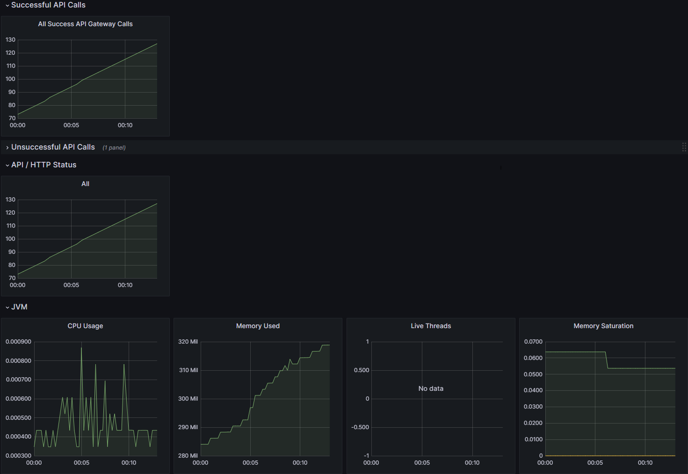
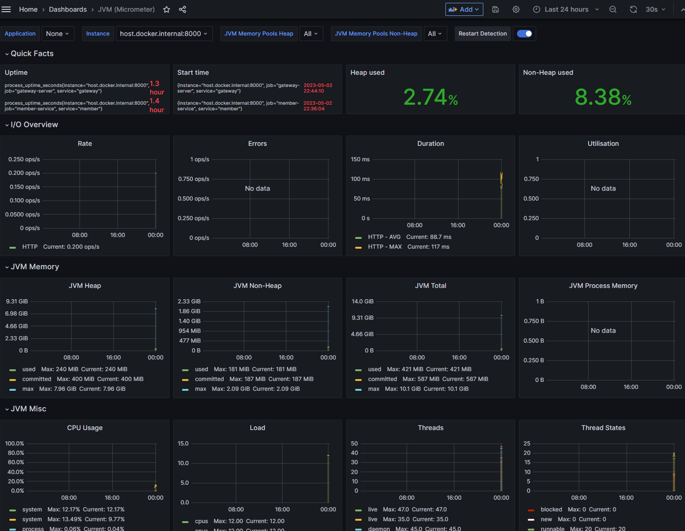

# 모니터링 구성(local + docker)

<aside>
💡 모든 docker 파일은 reservation-parent/Dockerfiles 에 있다.
	
	
</aside>  

<br>
  
**MSA 아키텍처**는 여러 개의 작고 독립적인 서비스로 분리하고 각 서비스간의 통신하도록 구성되어 있기 때문에 서비스 간의 복잡도와 의존성이 높아지기 때문에 장애가 발생할 확률이 높아진다.

그렇기 때문에 모니터링을 구성하는 것은 **필수**라고 볼 수 있다. 간단한 설정 방법이나 local(msa) + local(grafana + prometheus)를 구성하는 방법은 참고 링크로 모아놨다.

여기는 local로 서비스를 구성하고 docker로 **prometheus, zipkin, grafana**를 올릴 때, 각각의 설정 시 겪었던 시행착오를 적을 생각이다. 

<br>

---
## Spec

```java
springframework boot 3.0.5
prometheus 2.37.7(latest)
zipkin 2.24(latest)
grafana 9.5.1(latest)
```
---

<br>

## Zipkin

Zipkin을 처음 접한 건 [인프런 강의](https://www.inflearn.com/course/%EC%8A%A4%ED%94%84%EB%A7%81-%ED%81%B4%EB%9D%BC%EC%9A%B0%EB%93%9C-%EB%A7%88%EC%9D%B4%ED%81%AC%EB%A1%9C%EC%84%9C%EB%B9%84%EC%8A%A4/dashboard)에서다.  Zipkin은 분산 추적 시스템으로 각각의 서비스를 추적하여 **요청 소비하는 시간의 비율**이나 **작업 실패 여부**와 같은 정보를 추적하여 조회할 수 있게 해준다. 

이러한 요청 정보를 추적하려면 **trace id**와 **span id**가 필요한데. **span id**는 기본 작업 단위를 나타내고 **trace id**는 여러 개의 span id를 포함하는 트리 구조를 나타낸다. 

trace id는 하나의 요청을 처리하기 위해 여러 서비스를 호출되는 경우에도 동일한 값으로 유지된다. 

강의에서는 **zipkin**과 연동하기 위해 **spring cloud slueth**를 사용하는데. 똑같이 구성할 경우 아래와 같은 에러를 만나게 된다. 

```java
Error starting ApplicationContext. To display the condition evaluation report re-run your application with 'debug' enabled.
2023-05-02T00:50:17.777+09:00 ERROR [member-service,,] 18052 --- [           main] o.s.b.d.LoggingFailureAnalysisReporter   : 

***************************
APPLICATION FAILED TO START
***************************

Description:

Your project setup is incompatible with our requirements due to following reasons:

- Spring Cloud Sleuth is not compatible with this Spring Cloud release train

Action:

Consider applying the following actions:

- Migrate from Spring Cloud Sleuth to Micrometer Tracing .
You can check the Sleuth 3.1 Migration Guide over here [https://github.com/micrometer-metrics/tracing/wiki/Spring-Cloud-Sleuth-3.1-Migration-Guide]. 
If you want to disable this check, just set the property [spring.cloud.compatibility-verifier.enabled=false]
```

에러 메시지와 [마이그레이션 가이드](https://github.com/micrometer-metrics/tracing/wiki/Spring-Cloud-Sleuth-3.1-Migration-Guide)를 살펴보면 Spring Cloud Sleuth에서 Micrometer Tracing으로 옮겻다는 것을 확인할 수 있다.

그냥 무시하고 사용하려면 `spring.cloud.compatibility-verifier.enabled=false` 옵션을 주면되지만 바뀐 정보를 사용해보고자 한다. 

## Micrometer Tracing

Micrometer Tracing는 Micrometer의 Observation API를 확장하여 분산 추적을 지원하는 프로젝트다. 

### **의존성 추가**

```groovy
implementation 'io.micrometer:micrometer-tracing-bridge-brave' 
implementation 'io.zipkin.reporter2:zipkin-reporter-brave'
implementation 'io.micrometer:micrometer-observation'
implementation 'org.springframework.boot:spring-boot-starter-actuator' // 필수
```

### **로그 패턴 설정**

Micrometer Tracing 및 Spring Boot 3.0를 사용하면 직접 설정해줘야 한다. 

`logging.pattern.level: "%5p [${spring.application.name:},trace-id : %X{traceId:-}, span-id : %X{spanId:-}]"`

이렇게 구성하는 것만으로 Zipkin과의 연동 설정은 끝이 난다.  

### **참고**

[Micrometer and Zipkin(Spring Boot 3)](https://www.appsdeveloperblog.com/micrometer-and-zipkin-in-spring-boot/)

## Prometheus + Actuator

이 부분에서 삽질을 많이 했다. 찾아본 자료대로 했는데. 뭔가 하나씩 안되었었는데. 결국 해냄

먼저 바로 위에 의존성을 추가했지만 **Actuator**는 필수이다.  그리고 의존성을 몇 를를 더 추가해야 한다.

### **의존성 추가**

```groovy
// Micrometer to Prometheus
implementation 'io.micrometer:micrometer-registry-prometheus'

// aop
implementation 'org.springframework.boot:spring-boot-starter-aop'
```

먼저 Actuator가 필요한 이유는 actuator를 통해서 데이터를 수집하기 때문이다. 수집하기 위해선 다음과 같이 application.yml을 수정해야 하는데. **metrics**와 **prometheus**를 허용해야 한다.

### **application.yml**

```yaml
management:
  endpoints:
    web:
      exposure:
        include: health, info, metrics, info, prometheus, httptrace

  tracing:
    sampling:
      probability: 1.0
```

`mamagement.tracing.sampling.probability`는 추적 데이터가 얼마나 많이 수집되는 결정하는 비율이다. **0.0~1.0** 까지의 범위를 설정할 수 있는데. 1은 모든 요청을 추적한다는 것이다. 1로 할 경우 성능이나 저장 공간에 영향을 줄 수 있으니 적절한 값으로 설정해야 한다. 테스트 환경이니 1로 설정했다.

### Controller

```java
@GetMapping("/{userId}")
@Timed(value = "members.search", longTask = true)
public ResponseEntity<MemberInfoDto> getMember(@PathVariable String userId) {
	return ResponseEntity.ok(memberQueryService.findMemberByUserId(userId));
}
```

단순히 맴버를 조회하는 로직이다. 여기서 **@Timed** 에너테이션을 통해 intercepting types 이나 methods을 측정하고 관측 시스템에 전달할 수 있게 해주는데. **actuato**r의 **metrics**를 통해 확인이 가능하다. 처음에는 나오지 않지만 요청이 한 번이라도 이루어지면 나타난다. 

**value**는 매트릭스 이름이다. **longTask**는 장시간 실행되는 작업을 측정할지 여부를 지정한다. 

## Config

```java
@Configuration(proxyBeanMethods = false)
@EnableAspectJAutoProxy
public class MeticsConfig {

	@Bean
	public TimedAspect timedAspect(MeterRegistry registry) {
		return new TimedAspect(registry);
	}
}
```

**TimedAspect**를 빈으로 설정해야 **@Timed** 애너테이션이 달린 메서드를 **Proxy**로 감싸서 처리할 수 있다. 

이러한 설정을 위해 **AOP 의존성이 필요**했다. 

이제 Actuator를 통해 Timed로 추가한 정보를 metrics로 확인이 가능하다.

### Docker 설정

Docker로 grafana와 prometheus를 올리는 데. 계속 metrics에 대한 정보를 조회하지 못하는 일이 발생했다. prometheus.yml를 잘못 작성했나 싶어서 확인해봐도 이상이 없는 것으로 보였는데. 

**prometheus.yml(before)**

```yaml
# my global config
global:
  scrape_interval: 15s # Set the scrape interval to every 15 seconds. Default is every 1 minute.
  evaluation_interval: 15s # Evaluate rules every 15 seconds. The default is every 1 minute.
  # scrape_timeout is set to the global default (10s).

# Alertmanager configuration
alerting:
  alertmanagers:
    - static_configs:
        - targets:
          # - alertmanager:9093

# Load rules once and periodically evaluate them according to the global 'evaluation_interval'.
rule_files:
  # - "first_rules.yml"
  # - "second_rules.yml"

# A scrape configuration containing exactly one endpoint to scrape:
# Here it's Prometheus itself.
scrape_configs:
  # The job name is added as a label `job=<job_name>` to any timeseries scraped from this config.
  - job_name: "prometheus"

    # metrics_path defaults to '/metrics'
    # scheme defaults to 'http'.

    static_configs:
      - targets: ["localhost:9090"]

  - job_name : 'member-service'
    scrape_interval: 15s
    metrics_path: '/member-service/actuator/prometheus'
    static_configs:
    - targets: ["localhost:8000"]

  - job_name : 'gateway-server'
    scrape_interval: 15s
    metrics_path: '/actuator/prometheus'
    static_configs:
    - targets: ["localhost:8000"]
```

내 착각이었다. Docker를 실행하면 docker network를 통해서 사설 ip로 등록이 되는데. prometheus를 실행했을 때의 localhost는 본인이고 내 로컬 환경은 다른 ip 였었다. 당연한 거였는데... 이것 때문에 오래도록 삽질을 했다. 

로컬로 실행하지 않고 모든 서비스를 docker로 실행하면 도메인 명이나 컨테이너 명으로 등록하면 되지만 로컬로 실행했기에 다음과 같이 수정했다. 

`"localhost:8000"` **→** `"host.docker.internal:8000"`

이제 문제 없이 모니터링 설정이 완료된다.

**gateway**
  

**jvm**


**prometheus**
  

단순히 구글이나 강의를 통해 찾아본 정보만 해본터라 좀 더 자세한 사용법은 직접 사용해보면서 찾아보려 한다. 

## 참고

[actuator prometheus grafana set-up](https://hudi.blog/spring-boot-actuator-prometheus-grafana-set-up/)

[SpringBoot Actuator + Prometheus + Grafana](https://jydlove.tistory.com/70)

[Using the Observation API](https://openvalue.blog/posts/2022/12/16/tracing-in-spring-boot-2-and-3/)

[Micrometer Tracing](https://micrometer.io/docs/tracing)
