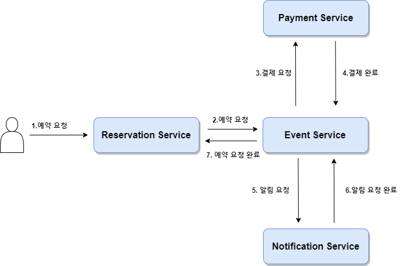
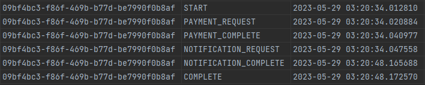
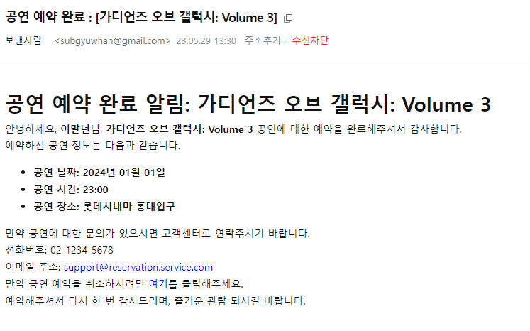

## 목차

#### [1.개요](#1-개요)

#### [2.흐름도](#2-흐름도)

#### [3.로그 기록과 EventBus](#3-로그-기록과-eventbus)

##### [1)로그 기록](#1-로그-기록)

##### [2)EventBus](#2-eventbus)

##### [3)예약 신청 완료](#3-예약-신청-완료)

#### [4.느낀점](#4-느낀점)

<br>

# 1. 개요

이번 글은 **MSA**에서 **분산 트랜잭션**을 제어하는 방법인 **사가 패턴**의 **orchestration 방식**에 대한 적용 글이다. orchestration 방식은 오케스트라의 지휘자를 연상하면 될 듯 싶다. 여러 복잡한 작업이나 워크플로우를 관리 및 조정, 구성을 의미하는데. 하나의 요청에 대해서 각 서비스의 요청과 응답을 한 곳에서 단계별로 관리한다. 

하지만 실제 적용된 소스를 찾을 수 없어서 관련 개념들을 읽고 직접 시행착오를 거치며 만들어 볼 수 밖에 없었다. (현업과 많이 다를 수 있다는 점)

모든 이벤트의 요청은 kafka를 통해서 전달하도록 구현했다.

<br>

# 2. 흐름도

**예약 신청**에 대해서 orchestration을 방식을 적용하기로 결정하고 **결제 서비스**는 예정되어 있지 않아서 임의로 만들었다. 단순히 결제 요청을 받으면 결제 완료 응답을 보내게만 구현해놨고 아래는 그 흐름도이다. 



처음 시작은 (1) 예약 서비스에서 예약 요청을 받아서 (2)이벤트 서비스에 전달한다. 이벤트 서비스는 **오케스트레이터** 역할을 한다. 예약 요청을 받은 이벤트 서비스는 미리 정의된 단계에 맞게 (3),(4),(5),(6),(7) 단계의 흐름을 제어한다. 

<br>

# 3. 로그 기록과 EventBus

Event Service에서는 다음과 같은 단계를 가진다.

1. 예약 서비스로부터 예약 요청 구독
2. 결제 서비스에 결제 요청 이벤트 발행
3. 결제 완료 응답을 받으면 알림 서비스에 알림 요청 이벤트 발행
4. 알림 요청 완료 이벤트를 받으면 예약 서비스에 예약 요청 완료 이벤트 발행

하나의 작업이 끝나면 다음 단계로 제어하여 그 순서를 지킬 수 있도록 구현하는 것이 목표이다. 

<br>

## 1) 로그 기록

하나의 요청에 대한 단계가 있으며 그 흐름이 중요하기 때문에 단계별 요청과 응답에 대한 저장을 추가로 구현했다. 

먼저 예약 요청에 대한 **SagaStep** enum 클래스이다.

### **SagaStep**

```java
public enum SagaStep {
	START,
	PAYMENT_REQUEST,
	PAYMENT_COMPLETE,
	PAYMENT_FAILED,
	PAYMENT_ROLLBACK,
	NOTIFICATION_REQUEST,
	NOTIFICATION_COMPLETE,
	RESERVATION_APPLY_ROLLBACK,
	RESERVATION_APPLY_COMPLETE,
	RESERVATION_APPLY_CANCELLED,
	COMPLETE
}
```

시작부터 요청에 대한 시작과 완료, 롤백에 대한 상태를 정의했고 이 값은 이제 DB에 그대로 저장될 것이다. 

### **SagaState Entity**

```java
public class SagaState extends BaseEntity{

	@EmbeddedId
	private SagaPK sagaPK;

	private SagaState(String id, SagaStep sagaStep) {
		this.sagaPK = new SagaPK(id, sagaStep);
	}

	public static SagaState of(String id, SagaStep sagaStep) {
		return new SagaState(id, sagaStep);
	}
}
```

### **SagaPK**

```java
@Embeddable
public class SagaPK implements Serializable {
   private String id;

   @Enumerated(EnumType.STRING)
   private SagaStep sagaStep;

   public SagaPK(String id, SagaStep sagaStep) {
      this.id = id;
      this.sagaStep = sagaStep;
   }

   public SagaPK() {
   }
}
```

사가의 상태를 그 흐름별로 저장하기 위해 복합키를 사용했다. id 값과 sagaStep을 키로 저장함으로써 중복된 id에 대한 step을 저장할 수 있다. 이제는 각 단계에 대한 순서를 기록하여 장애 위치 조회가 가능해진다.



<br>

## 2) **EventBus**

오케스트레이터 역할을 가진 이벤트 서비스에서 각 요청에 대한 흐름 제어를 구현하는 데에 아주 많은 고심이 필요했다. 그 이유는 이벤트는 **비동기**로 이루어지기 때문이었는데. **카프카를 통해서 각 서비스에 이벤트를 전달하고 응답을 받은 다음에 다음 단계를 호출하기 위한 구현이 어려웠다.**

단순히 **REST API**로 요청하고 응답을 받는다면 응답 값을 받은 다음에 다음 메서드를 호출하면 된다. 

```java
// 예시
public void reservationRequest(ReservationApplyReqeust reservationApplyRequest) {
	// payment 요쳥 객체 생성
	...

	// 결제 요청 및 응답
	PaymentResponse paymentResponse = paymentService.send(paymentRequest);

	// 다음 단계 시작
}

```

하지만 **event**를 발행하는 비동기 방식은 반환 값이 void이고 consumer는 다른 객체의 메서드에 포함되어 있기 때문에 위와 같은 방법으로는 해결할 수 없었다. 

만약 억지로 진행한다고 하면 강제로 스레드를 응답이 올 때까지 대기로 만드는 방법밖에는 떠오르지 않았다. 

```java
public void publishPaymentCompleteEvent(ReservationApplyRequest event) {
  // payment 요청 이벤트 발행
  eventPublisher.publishPaymentRequestEvent(event); // 반환 값 void

  // 응답을 어떻게? 스레드 대기??

}
```

대안으로 떠오른 방법 중 하나는 각 단계에 요청이 올 때마다 조회하고 저장하는 것이었다. 새로운 이벤트 요청이 올 때마다 DB를 조회해서 완료된 단계의 다음 단계를 진행하는 것이었는데. 결국 다음 단계에 맞는 메서드를 핸들링해줘야 하는데.. 

고심 끝에 떠오른 방법은 **EventBus**의 구현이었다. **EventBus란 구독받은 이벤트에 대해 적절한 구독자에게 이벤트를 전달하는 것**인데. 이 방법을 사용해서 이벤트에 맞는 메서드를 전달하도록 구현했다. 

### **EventBus**

```java
/**
 * 이벤트를 전달하는 이벤트 버스
 */
public class EventBus {
	private Map<Class<?>, Consumer<?>> map;

	public EventBus() {
		map = new HashMap<>();
	}

	/**
	 * 이벤트와 핸들러 등록
	 */
	public <T> void register(Class<?> eventType, Consumer<T> handler) {
		map.putIfAbsent(eventType, handler);
	}

	/**
	 * 이벤트를 핸들러에 발행
	 */
	public <T> void publish(T event) {
		Consumer<?> handler = map.get(event.getClass());

		if(handler != null) {
			receive(event, handler);
		}
	}

	@SuppressWarnings("unchecked")
	private <T> void receive(T event, Consumer<?> handler) {
		((Consumer<T>) handler).accept(event);
	}
}
```

모든 이벤트는 내부 필드인 map에 각각의 Class로 분류하였고 함수형 인터페이스인 Consumer를 통해 각 메서드를 매핑하도록 했다.  

### **Saga 인터페이스**

```java
/**
 * 오케스트레이션 사가
 */
public interface Saga {

	/**
	 * 사가 시작
	 */
	void start(ReservationApplyRequest request);

	/**
	 * 이벤트 헨들러
	 */
	void handle(Object response);

	/**
	 * 사가 종료
	 */
	void end(String id);
}
```

모든 사가 오케스트레이터는 **start**과 **handle, end** 라는 메시지를 가진다.

### **예약 요청 오케스트레이터**

```java
public class ReservationRequestSaga implements Saga {
	private static final SagaStep START = SagaStep.START;
	private static final SagaStep PAYMENT_REQUEST = SagaStep.PAYMENT_REQUEST;
	private static final SagaStep PAYMENT_COMPLETE = SagaStep.PAYMENT_COMPLETE;
	private static final SagaStep PAYMENT_FAILED = SagaStep.PAYMENT_FAILED;
	private static final SagaStep NOTIFICATION_REQUEST = SagaStep.NOTIFICATION_REQUEST;
	private static final SagaStep NOTIFICATION_COMPLETE = SagaStep.NOTIFICATION_COMPLETE;
	private static final SagaStep RESERVATION_APPLY_ROLLBACK = SagaStep.RESERVATION_APPLY_ROLLBACK;
	private static final SagaStep RESERVATION_APPLY_CANCELLED = SagaStep.RESERVATION_APPLY_CANCELLED;
	private static final SagaStep COMPLETE = SagaStep.COMPLETE;

	@Override
	public void start(ReservationApplyRequest request) {
		saveSageState(SagaState.of(request.getId(), START)); // 시작 저장
		...
	}

	@Override
	public void handle(Object response) {
		....
	}

	@Override
	public void end(String id) {
		sagaStateService.saveSagaState(SagaState.of(id, COMPLETE)); // 완료 저장
	}
	....
}
```

예약 요청 오케스트레이터의 시작과 끝은 그리고 모든 handle 안에서는 각 단계를 DB에 저장하도록 했다. 

```java
public class ReservationRequestSaga implements Saga {
	.... 중략
	
	private EventBus eventBus;
	
	// 객체 생성 후 초기화
	@PostConstruct
	public void init() {
		eventBus = new EventBus();
		registerEvents();
	}

	// 이벤트와 핸들러를 map에 저장
	private void registerEvents() {
		eventBus.register(ReservationApplyRequest.class, this::handleReservationApplyRequest);
		eventBus.register(PaymentCompleteEvent.class, this::handlePaymentCompleteEvent);
		eventBus.register(PaymentFailedEvent.class, this::handlePaymentFailedEvent);
		eventBus.register(ReservationCancelEvent.class, this::handleReservationCancelEvent);
		eventBus.register(NotificationCompleteEvent.class, this::handleNotificationCompleteEvent);
	}

	// 예약 요청 핸들러
	private void handleReservationApplyRequest(ReservationApplyRequest request) {
		saveSageState(SagaState.of(request.getId(), PAYMENT_REQUEST));

		PaymentRequestEvent event = PaymentRequestEvent.from(request);
		eventPublisher.publishPaymentRequestEvent(event);
	}

	// 결제 완료 이벤트 핸들러
	private void handlePaymentCompleteEvent(PaymentCompleteEvent event) {
		saveSageState(SagaState.of(event.getId(), PAYMENT_COMPLETE));
		saveSageState(SagaState.of(event.getId(), NOTIFICATION_REQUEST));

		publishNotificationRequestEvent(event);
	}

	// 결제 실패 이벤트 핸들러
	private void handlePaymentFailedEvent(PaymentFailedEvent event) {
		saveSageState(SagaState.of(event.getId(), PAYMENT_FAILED));
		saveSageState(SagaState.of(event.getId(), RESERVATION_APPLY_ROLLBACK));

		publishReservationApplyRollbackEvent(event);
	}

	// 알림 완료 이벤트 핸들러
	private void handleNotificationCompleteEvent(NotificationCompleteEvent event) {
		saveSageState(SagaState.of(event.getId(), NOTIFICATION_COMPLETE));
		end(event.getId());
	}

	// 예약 취소 이벤트 핸들러
	private void handleReservationCancelEvent(ReservationCancelEvent event) {
		saveSageState(SagaState.of(event.getId(), RESERVATION_APPLY_CANCELLED));
		end(event.getId());
	}

	// 사가 상태 저장
	private void saveSageState(SagaState sagaState) {
		sagaStateService.saveSagaState(sagaState);
	}

	// 예약 신청 롤백 이벤트 발행
	private void publishReservationApplyRollbackEvent(PaymentFailedEvent event) {
		ReservationApplyRollbackEvent applyRollbackEvent = ReservationApplyRollbackEvent.of(event);
		eventPublisher.publishReservationApplyRollbackEvent(applyRollbackEvent);
	}

	// 알림 요청 이벤트 발행
	private void publishNotificationRequestEvent(PaymentCompleteEvent event) {
		NotificationRequestEvent notificationRequestEvent = NotificationRequestEvent.from(event);
		eventPublisher.publishNotificationRequestEvent(notificationRequestEvent);
	}
...
}
```

예약 요청 오케스트레이터의 초기화 과정에는 사용할 이벤트와 handler를 **EventBus**에 저장해준다. 

이제는 처음 예약 신청 요청에 대한 이벤트를 받아서 start를 한 뒤, 비동기로 요청이 올 때마다 해당하는 클래스로 받은 다음 `ReservationRequestSaga.handle(event);` 를 해주기만 하면 알아서 다음 단계로 매핑해준다. 

<br>

## 3) **예약 신청 완료**

EventService에 구현한 오케스트레이터를 통해서 각 단계에 대해서 흐름을 제어해주고 알림 서비스까지 모두 전달이 완료가 되면 아래와 같은 메일이 발송된다. 



욕심으로는 sms 까지 구현하고 싶었지만 유료 서비스로 알고있어서 메일까지만 구현했다. 

<br>

# 4. 느낀점

오케스트레이션과 코레오그래피 방식의 장단점을 찾아보니 다음과 같았다. 

- 오케스트레이션 방식은 트랜잭션 상태를 명확하게 확인할 수 있고 복잡한 워크플로우에 적용할 수 있지만 각 서비스가 오케스트레이터에 의존적이기 때문에 느슨한 결합을 해지게 된다.
- 코레오그래피 방식은 각 서비스가 이벤트를 발행하고 구독하면서 트랜잭션을 수행하고 느슨한 결합과 확장성을 유지할 수 있지만 트랜잭션의 상태를 추적하기 어렵고 이벤트의 순서나 일관성을 보장하기 어렵다.

직접 두 가지를 구현해본 느낀점으로는 코레오그래피는 구현상 어렵지 않았지만 만약 연동된 서비스들이 많고 서비스들을 기록하지 않으면 추적이 상당히 힘들겠구나 싶었다. 관리가 힘들지 않을까 싶었고 오케스트레이션은 구현의 복잡도가 조금 높았지만 한 곳에서 모든 흐름을 파악할 수 있었기 때문에 괜찮았다고 생각한다.

<br>

### * 참고

https://azderica.github.io/01-architecture-msa/

https://www.baeldung.com/cs/saga-pattern-microservices